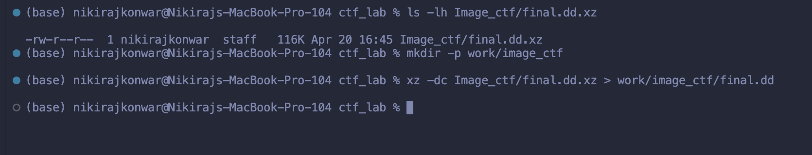
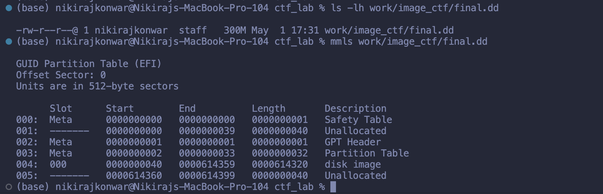
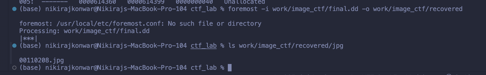
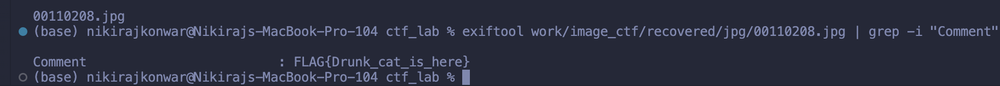
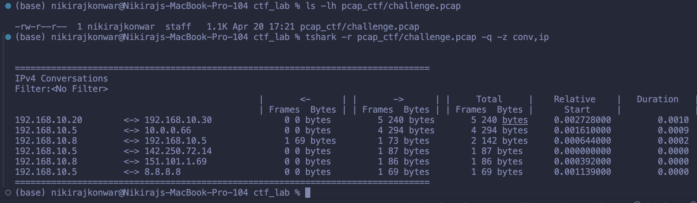
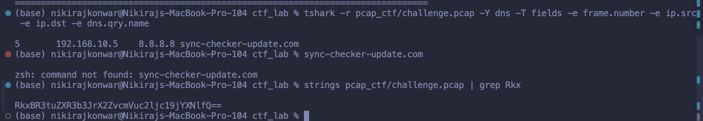
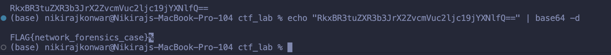

# Digital Forensics CTF Solution Flow Report

## 1. Introduction

This report explains the solution flow for two digital forensics Capture The Flag challenges:

1. Image Metadata Disk Forensics Challenge
2. Suspicious Network Traffic PCAP Challenge

The purpose of the report is to show how each challenge was solved from the provided evidence files, including the commands used, the meaning of each result, and the final flags recovered from the evidence.

## Docker CTF Lab

This repository also includes a Docker setup so the CTF can be played in a clean environment with the required tools already installed.

To play the CTF, download or clone this repository and make sure the `Dockerfile` is included. The Dockerfile builds a container that contains the challenge files, solution files, and all required forensic tools.

Build the image:

```bash
docker build -t forensics-ctf-lab .
```

Start the container:

```bash
docker run --rm -it forensics-ctf-lab
```

Inside the container, the challenge files are located here:

```text
/ctf/challenges/image_metadata_disk_forensics
/ctf/challenges/suspicious_network_traffic_pcap
```

The solutions are located here:

```text
/ctf/solutions
```

The Docker image only copies the necessary challenge files, challenge README files, and solution files.

## 2. Tools Used

The following command-line tools were used during the investigation:

- `ls` to confirm that evidence files exist.
- `xz` to decompress the disk image.
- `mmls` to inspect the disk image partition table.
- `foremost` to recover deleted files from the disk image.
- `exiftool` to inspect image metadata.
- `tshark` to inspect packet capture traffic.
- `strings` to extract readable strings from binary files.
- `grep` to filter important output.
- `base64` to decode the encoded payload found in the PCAP.

## Task 1: Image Metadata Disk Forensics

### 3. Challenge Objective

The first challenge is named **Deleted Cat Evidence**.

The provided evidence file is:

```text
Image_ctf/final.dd.xz
```

The objective is to analyze the compressed disk image, recover the deleted image file, and extract the hidden flag from the recovered image metadata.

### 4. Solution Flow

#### Step 1: Confirm the evidence file and decompress the disk image

The first step was to confirm that the compressed disk image existed:

```bash
ls -lh Image_ctf/final.dd.xz
```

The output showed that `final.dd.xz` was present. After that, a working directory was created and the compressed disk image was decompressed:

```bash
mkdir -p work/image_ctf
xz -dc Image_ctf/final.dd.xz > work/image_ctf/final.dd
```

This created a working copy named `work/image_ctf/final.dd`. This is important because the original challenge evidence should not be modified during analysis.



#### Step 2: Inspect the disk image structure

After decompression, the disk image was inspected with `mmls`:

```bash
mmls work/image_ctf/final.dd
```

The output showed a GUID Partition Table and a partition beginning at sector 40:

```text
004:  000       0000000040   0000614359   0000614320   disk image
```

This confirmed that the file was a valid disk image and that forensic recovery could continue.



#### Step 3: Recover deleted files from the disk image

The next step was to carve files from the disk image using `foremost`:

```bash
foremost -i work/image_ctf/final.dd -o work/image_ctf/recovered
```

`foremost` processed the disk image and recovered files into the `work/image_ctf/recovered` folder. The warning about `foremost.conf` did not stop the recovery; the tool still processed the image successfully.



#### Step 4: Locate the recovered JPG and read metadata

The recovered JPG folder was listed:

```bash
ls work/image_ctf/recovered/jpg
```

The recovered file was:

```text
00110208.jpg
```

The image metadata was then inspected:

```bash
exiftool work/image_ctf/recovered/jpg/00110208.jpg | grep -i "Comment"
```

The metadata comment contained the flag:

```text
Comment                         : FLAG{Drunk_cat_is_here}
```



### 5. Task 1 Result

The hidden flag was found in the `Comment` metadata field of the recovered JPG image.

**Task 1 flag:**

```text
FLAG{Drunk_cat_is_here}
```

## Task 2: Suspicious Network Traffic PCAP

### 6. Challenge Objective

The second challenge is named **Suspicious Office Traffic**.

The provided evidence file is:

```text
pcap_ctf/challenge.pcap
```

The objective is to analyze the packet capture, identify suspicious communication, find the suspicious domain, extract the encoded payload, and decode the final flag.

### 7. Solution Flow

#### Step 1: Confirm the PCAP and view IP conversations

The first step was to confirm that the PCAP file existed:

```bash
ls -lh pcap_ctf/challenge.pcap
```

Then the IP conversations were viewed with `tshark`:

```bash
tshark -r pcap_ctf/challenge.pcap -q -z conv,ip
```

The conversation table showed suspicious communication between:

```text
192.168.10.5 <-> 10.0.0.66
```

This indicates that internal host `192.168.10.5` communicated with external IP address `10.0.0.66`.



#### Step 2: Identify the suspicious DNS request

DNS traffic was filtered with `tshark`:

```bash
tshark -r pcap_ctf/challenge.pcap -Y dns -T fields -e frame.number -e ip.src -e ip.dst -e dns.qry.name
```

The important result was:

```text
5    192.168.10.5    8.8.8.8    sync-checker-update.com
```

This shows that host `192.168.10.5` queried the suspicious domain `sync-checker-update.com`.

The screenshot also shows an accidental attempt to run `sync-checker-update.com` as a terminal command. The `zsh: command not found` message is not part of the forensic result. The important evidence is the DNS query output above it.

#### Step 3: Extract the encoded payload from the PCAP

Readable strings were extracted from the PCAP and filtered for the Base64-looking payload:

```bash
strings pcap_ctf/challenge.pcap | grep Rkx
```

The encoded payload found was:

```text
RkxBR3tuZXR3b3JrX2ZvcmVuc2ljc19jYXNlfQ==
```



#### Step 4: Decode the Base64 payload

The encoded string was decoded with `base64`:

```bash
echo "RkxBR3tuZXR3b3JrX2ZvcmVuc2ljc19jYXNlfQ==" | base64 -d
```

The decoded output revealed the flag:

```text
FLAG{network_forensics_case}
```

The `%` shown after the flag in the terminal is not part of the flag. It is the shell showing that the decoded output did not end with a newline.



### 8. Task 2 Result

The suspicious host was `192.168.10.5`. It communicated with `10.0.0.66`, queried the suspicious domain `sync-checker-update.com`, and contained a Base64-encoded payload in the PCAP.

**Task 2 flag:**

```text
FLAG{network_forensics_case}
```

## 9. Final Results

The final recovered flags are:

```text
Task 1 Image CTF Flag: FLAG{Drunk_cat_is_here}
Task 2 PCAP CTF Flag:  FLAG{network_forensics_case}
```

## 10. Conclusion

Both challenges were completed successfully.

The image forensics challenge demonstrated disk image handling, partition inspection, deleted file recovery, and metadata analysis. The hidden flag was recovered from the comment field of the deleted JPG image.

The PCAP forensics challenge demonstrated network traffic analysis, suspicious host identification, DNS investigation, encoded payload extraction, and Base64 decoding. The hidden flag was recovered by decoding the suspicious payload found inside the packet capture.
